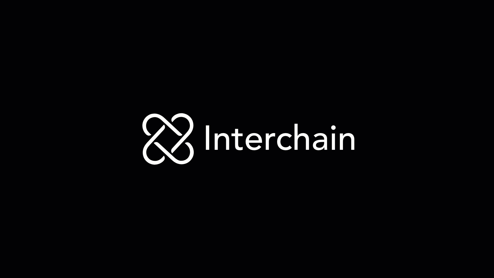
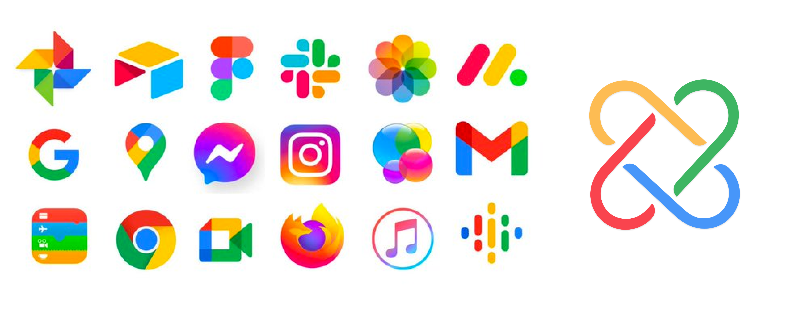
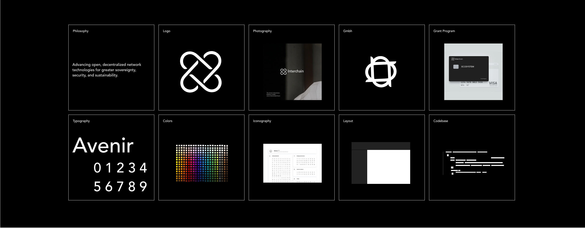
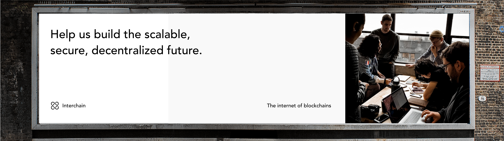
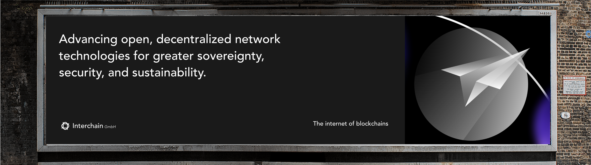
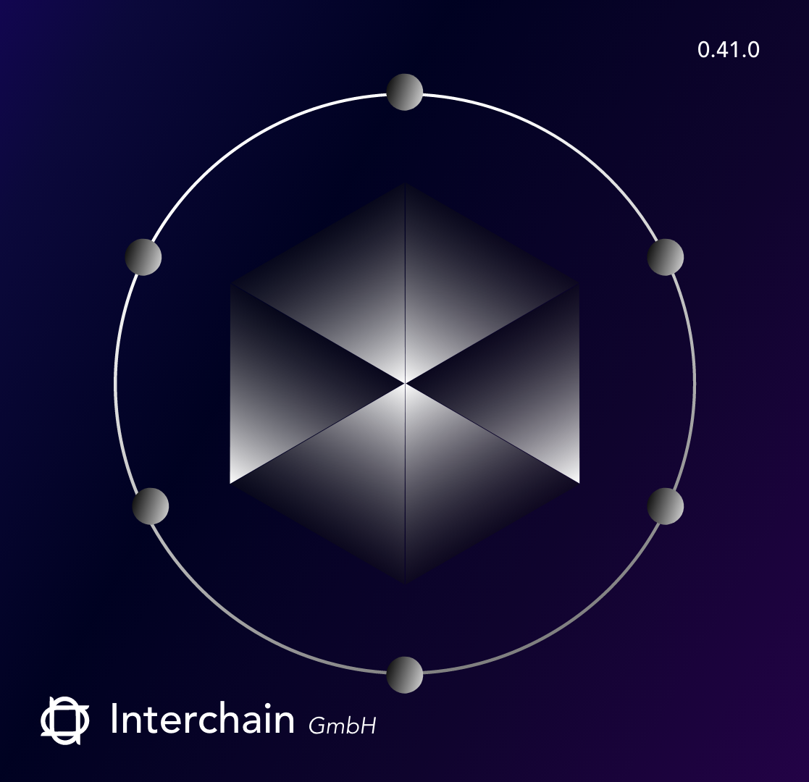

  
  
  

  
   
  
 Thoughts 

  <h3> This is a culmination of things that crossed my mind and general ideas.  </h3>
  
 By Jessica Dosseh 

   

 

### Overview

---

This is a quick glimpse, note that this idea is not fully fleshed out. 

 
 

### The logo is not the brand

---

**In this section, we will only be diving into the trademark.**

The purpose behind trademarks is to allow companies to indicate the source of their goods or services and to distinguish them from others in the industry.

Here are the first thoughts that crossed my mind —

 

> Slow down gif below 👇  👇

 

| Logo Transformation                                        | Logo Transition — Interchain & Interchain Gmbh         |
| ---------------------------------------------------------- | ------------------------------------------------------ |
|  |  |

 

**Logo Transformation Process**

- [ ] Start with the original logo
- [ ] Strip the logo colors
- [ ] Smooth out the edges
- [ ] Move typeface from `Upper Case` to `Sentence Case`
- [ ] Add a logo transition to Interchain Gmbh

  
 The purpose of these slight changes — Toggle to read. 

   
  
  <h6> I don't think there is anything wrong with the original logo, but I think it could be a bit more refined. </h6>

   

  <h6> Strip the logo colors </h6>
  
A multicolored logo isn't an impossible design system strategy, but personally, I would say move away from the logo color shelf and instead used color to accent components of the design system.

  
If Interchain were a singular product, I would say it wouldn't matter either way, but because Interchain is a foundation, I think having a cleaner enterprise look would be more suitable.

  

   

  <h6> Smooth out the edges</h6>
  
I know that it may seem like there is no difference; however, this change is simply to make the logo cleaner and slightly more refined by utilizing white space. Breathing air into the logo.

   

  <h6> Move typeface from `Upper case` to `Sentence case`  </h6>
  
This is my own personal opinion but the upper case typeface gives the logo an outdated look — however upper case can be use if you were trying to give the brand a high end premium look by adding more white space between the letters. 

  
For this particular brand I think that Sentence case is the way to go because it gives it a modern and timeless look.

   

  <h6> Add a logo transition to Interchain Gmbh </h6>
  
The logo transition for Interchain GmbH gives GmbH it's own identity space while still being fully part of Interchain. 

 
 

### First pass styling

---

> The purpose of this is to allow the brand to speak to the broader general population while allowing it's minimalistic style to accommodate a variety of other design systems within the global ecosystem and future design trends.

 

  

 

|                                                                   |                                                                     |
| ----------------------------------------------------------------- | ------------------------------------------------------------------- |
| General Community Facing                                          |                                                                     |
|    |    |
| Technical Community Facing                                        |                                                                     |
|  |  |

 
 
